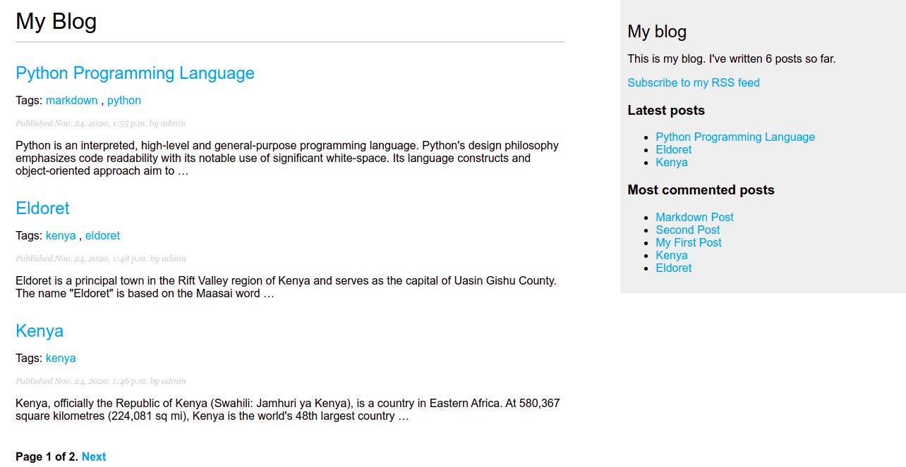
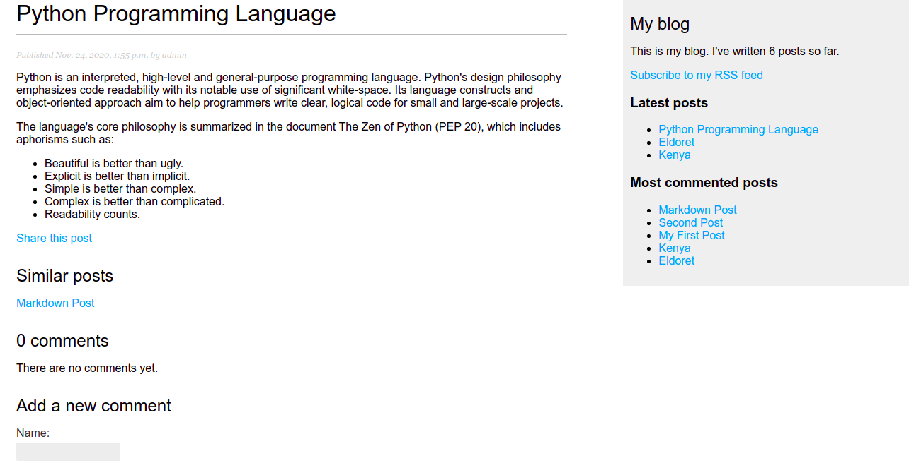

# Bloggy

This project covers how to create a production-grade blog application using Django Web Framework. The
project's purpose is to get a general idea of how the framework works,
an understanding of how the different components interact with each other, and
the skills to easily create Django projects with basic functionality.



## Prerequisites

To be able to run this project you should have:

* A basic understanding of Docker and Docker Compose.
* Docker and Docker Compose installed on your local machine.

## Running the application

To get this project running on your local machine, execute the following commands:

### 1. Clone the repository

```cmd
git clone https://github.com/samwelkanda/bloggy.git
```

### 2. Set Up Environment File

Create a `env.dev` configuration file with environment constants for running the project. 
Refer to `.env.example` file for pointers.

```cmd
cd bloggy
touch config/.env.dev
```

### 3. Build the docker image and run the containers

```cmd
docker compose up -d --build
```

Depending on your permissions, you may need to update the `entrypoint.sh` file permissions 
locally.

```cmd
RUN chmod +x entrypoint.sh
```

### 4. Navigate to http://0.0.0.0:8000/ to access the site.

## Features



### Post Pagination

### Sharing posts via email

Readers can share articles via email.

### Comments

Readers can comment on posts and create discussions.

### Tags

Tags allow authors to categorize posts in a non-hierarchical manner, using simple keywords.

### Post Recommendation

Using tagging system, the application recommends other posts that share tags with a certain blog post.

### Sitemap and Post feed: 

You will learn how to use the sitemaps framework and syndication framework that come with Django.

### Full-text search with PostgreSQL

The application comes with an advanced search engine powered by postgresql